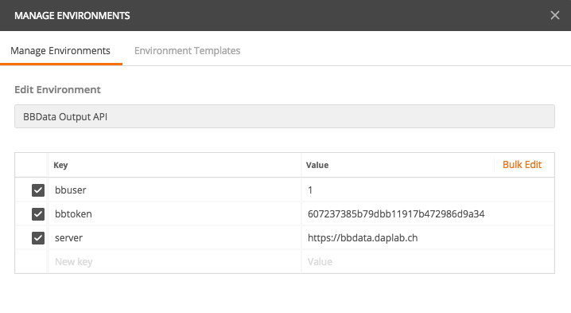

The output API is a REST service that let you manage resources and query values.

## Security and Authentication

As stated [here](conception.md), users need a valid apikey to access the output API. 

### Getting an apikey

:::info 
You can use the [admin console](admin-console.md) to manage apikeys. 
:::

It is possible to generate a temporary apikey using the `/login` endpoint. Using curl:

```bash
# creds.json contains: { "username": "<USERNAME>", "password": "<PASSWORD>" }
curl -H "Content-Type: application/json" \
    -X POST \
    -d @creds.json \
    https://bbdata.daplab.ch/api/login   
```

The answer will be something like: 
```json
{"description":"auto_login","expirationdate":"2017-06-30T14:37:53.816","id":3485,"readOnly":false,"secret":"e2356d757006bfddba9001dafefccd23","userId":1} 
```

The two fields that are of interest are `userId` and `secret`. 

### Adding authentication to requests

Each subsequent request to the output API should include the two following headers:

```
bbuser: <userId>
bbtoken: <secret>
```

With curl, use the `-H` option:

```bash
curl -H 'bbuser: 1' \
     -H 'bbtoken: e2356d757006bfddba9001dafefccd23' \
     https://bbdata.daplab.ch/api/me   
```

### Creating a permanent apikey

In case you don't want to login each time (the apikey is valid for only two hours), you can either generate a new apikey with no expiration date or modify the expiration date of the created apikey.

For example, to create a new read-and-write apikey with no expiration date and a description:
```bash
curl -H 'Content-Type: application/json' \
     -H 'bbuser: 1' \
     -H 'bbtoken: e2356d757006bfddba9001dafefccd23' \
     -X PUT \
     -d '{"description": "my apikey"}' \
     "https://bbdata.daplab.ch/api/me/apikeys?writable=true"
```

To modify the current apikey, use the `POST` method. Copy-paste the response of the `login` request and remove the `expirationdate` field:
```bash
curl -H 'Content-Type: application/json' \
     -H 'bbuser: 1' \
     -H 'bbtoken: e2356d757006bfddba9001dafefccd2c' \
     -X POST \
     -d '{"description":"auto_login modified","id":3485,"readOnly":false,"secret":"e2356d757006bfddba9001dafefccd23","userId":1} ' \
     "https://bbdata.daplab.ch/api/me/apikeys?writable=true"
```

## Documentation

The whole API is documented using RAML. You can consult the HTML version at [https://bbdata.daplab.ch/api](https://bbdata.daplab.ch/api).

## Testing

To familiarise yourself with the API, you need a tool to easily make requests. We present here two of those tools, curl and postman.

### Curl

curl is a command line tool available in Linux and Mac OS X. 

_For Windows users_: Windows 10 comes with a native bash shell. If you have an earlier version of Windows, have a look at [babun](http://babun.github.io/) or [cygwin](https://www.cygwin.com/) to emulate linux shells.

curl is very easy to use, as you have seen in the example above. Many tutorials are available if you need more information.

### POSTMAN

[postman](https://www.getpostman.com/) is a powerful GUI platform for API development and testing available for Linux, Mac, Windows and Chrome.  

To get started, follow those steps:

1. download [the BBData API description for postman](resources/postman_bbdata-output-api.json). 
2. On the postman interface, click on _import_ and select the downloaded file. This will create a collection with all output API requests. 
3. On the postman interface, click on _settings > manage environments > add_. 
4. Give your environment a name and add three properties: (A) `server` the url of the server (B) `bbuser` your user id (C) `bbtoken` a valid apikey:<br/><br/>



5. Save the environment and select it on the dropdown at the top right of the interface. 

You should be all set ! Try to click on a request and hit send. 
